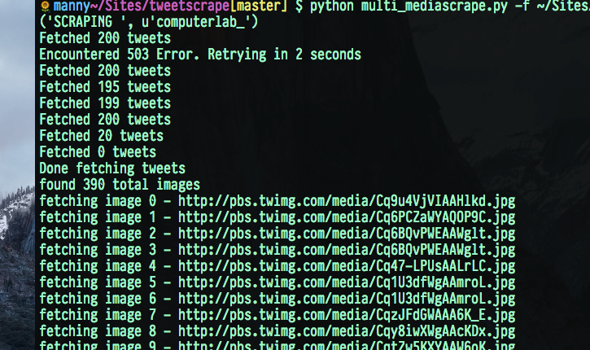

# tweetscrape

<p align="center">
  
</p>

## Usage

Add your [twitter api](https://apps.twitter.com/) credentials to `config.json` in project root

eg:

```js
{
  "consumer_key": "XXX",
  "consumer_secret": "XXX",
  "access_token_key": "XXX",
  "access_token_secret": "XXX"
}
```

## tweetscrape

to download up to 3200 recent tweets from user: 

`python tweetscrape.py -u [user]`

eg: `python tweetscrape.py -u lilbthebasedgod`

this will save a `.json` file of tweets to `/data/[user].json`

## mediascrape

to download all media images from a user 

`python mediascrape.py -u [user]`

eg: `python mediascrape.py -u lilbthebasedgod`

this will save all files to a directory of `/media/[user]/*`

## multi\_mediascrape

_note: to use multi media scraper youll need multiple accounts as youll probably rate limit otherwise_

**if you dont have multiple accounts pass -s to just use single account**

create an `accounts.json` in project root with the following structure:

```js
[
  {
    "consumer_key": "XXX",
    "consumer_secret": "XXX",
    "access_token_key": "XXX",
    "access_token_secret": "XXX"
  },
  {
    "consumer_key": "XXX",
    "consumer_secret": "XXX",
    "access_token_key": "XXX",
    "access_token_secret": "XXX"
  }
]
```

to download all media images from a list of users, make a line-seperated `.txt` list of users and pass it to `multi_mediascrape` with `-f` 

`python multi_mediascrape.py -f [txt file of names]`

eg: `python multi_mediascrape.py -f /home/me/tweetscrape/models/names.txt`

this will save all files to a directory of `/media/[user]/*`

## memefinder

experimental script to find the same images posted in different tweets, possibly
suggesting the image is of meme interest

`python memefinder.py -d [optional directory] -x [show cross post only]`

## Dependencies

```bash
pip install -r requirements.txt
```
